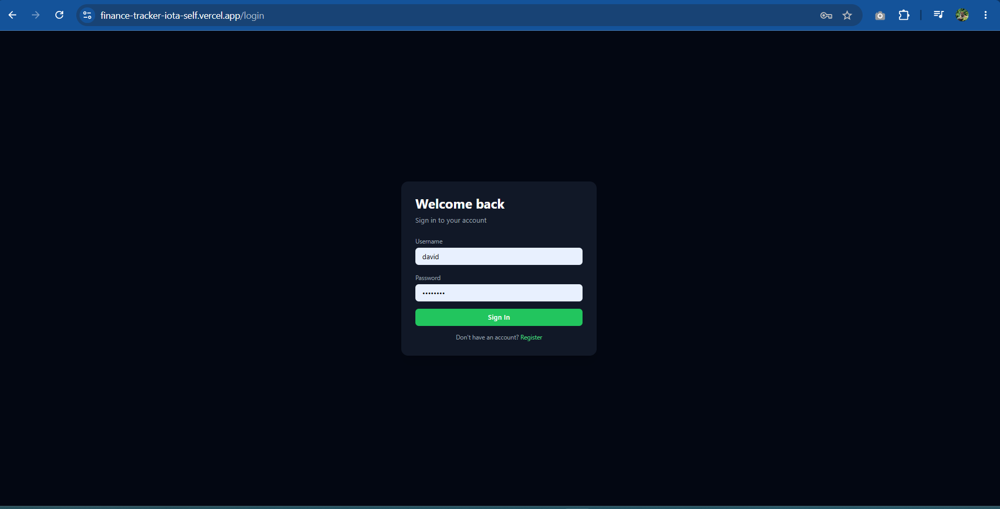
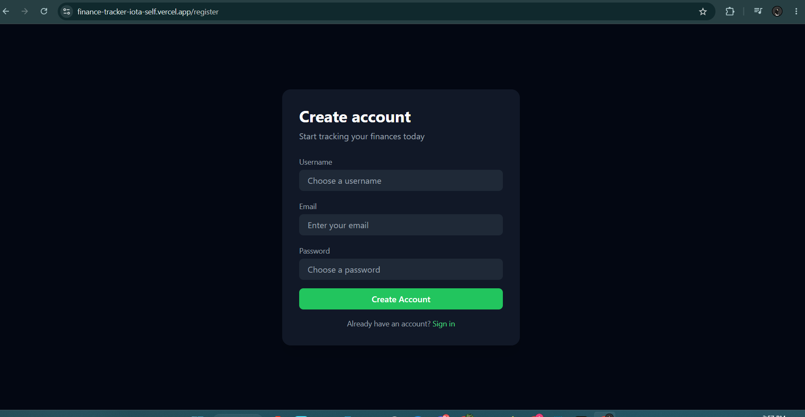
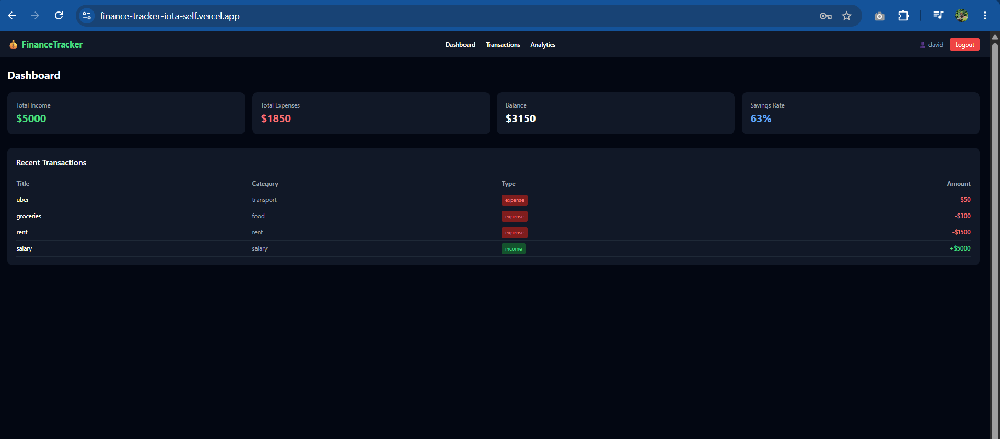
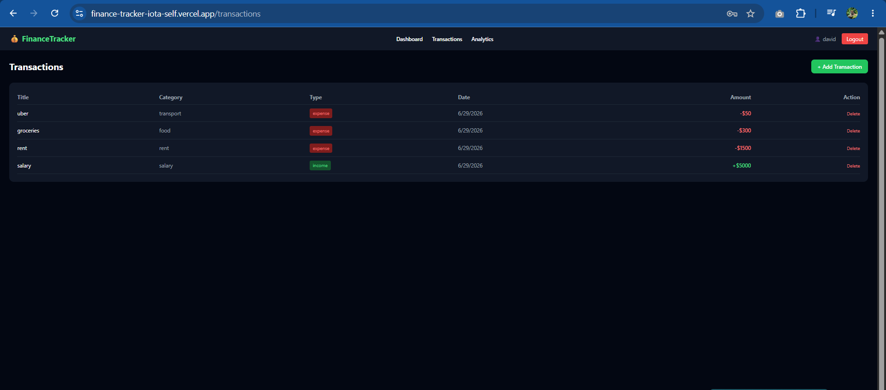
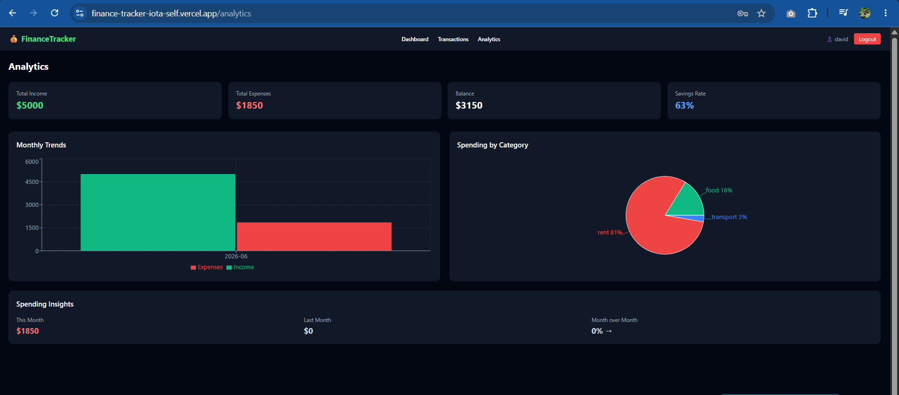
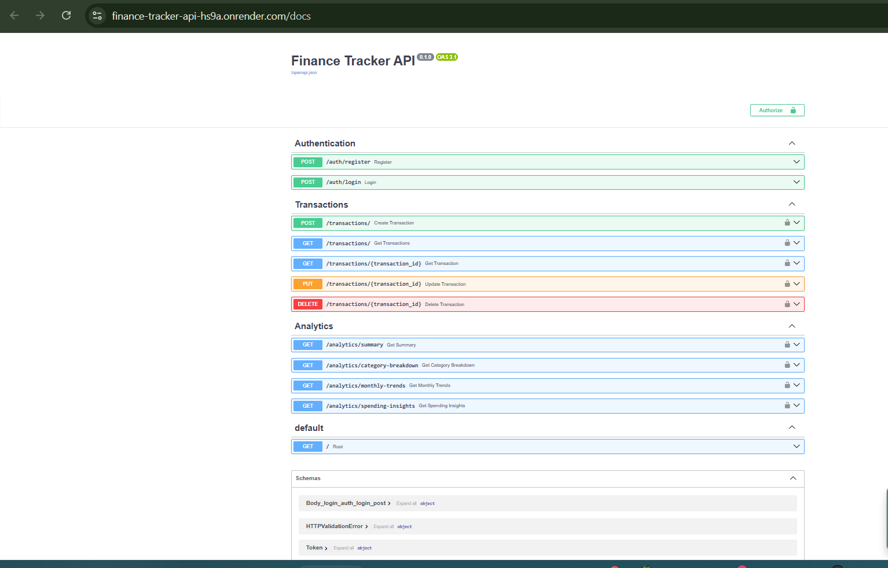

# 💰 Personal Finance Tracker

A full-stack web application for tracking personal income and expenses. Users can register, log in, manage transactions by category, and visualize spending patterns through interactive charts and analytics.

🔗 **Live Demo:** [finance-tracker-iota-self.vercel.app](https://finance-tracker-iota-self.vercel.app)
📡 **API Docs:** [finance-tracker-api-hs9a.onrender.com/docs](https://finance-tracker-api-hs9a.onrender.com/docs)

---

## 🚀 Tech Stack

**Frontend**
- React + Vite
- Tailwind CSS
- Recharts
- Axios
- React Router DOM

**Backend**
- FastAPI
- SQLAlchemy
- PostgreSQL (Neon)
- JWT Authentication
- Pydantic

**Deployment**
- Frontend → Vercel
- Backend → Render
- Database → Neon (PostgreSQL)

---

## ✨ Features

- 🔐 JWT-based authentication — register, login, logout
- 💳 Full CRUD for financial transactions
- 📊 Interactive dashboard with income, expenses, balance and savings rate
- 📈 Monthly trends bar chart — income vs expenses over time
- 🥧 Spending by category pie chart
- 🔍 Month-over-month spending insights
- 🛡️ Protected routes — each user sees only their own data
- 📱 Responsive dark UI

---

## 📸 Screenshots

### Login


### Register


### Dashboard


### Transactions


### Analytics


### API Docs (Swagger)


---

## 🛠️ Run Locally

### Backend

```bash
cd backend
python3 -m venv venv
source venv/bin/activate
pip install -r requirements.txt
```

Create a `.env` file in `backend/`:

```
DATABASE_URL=your_neon_postgresql_url
SECRET_KEY=your_secret_key
```

Start the server:

```bash
uvicorn main:app --reload
```

### Frontend

```bash
cd frontend
npm install
npm run dev
```

---

## 👤 Author

**David Wafula**
- GitHub: [@davidtiger3622](https://github.com/davidtiger3622)
